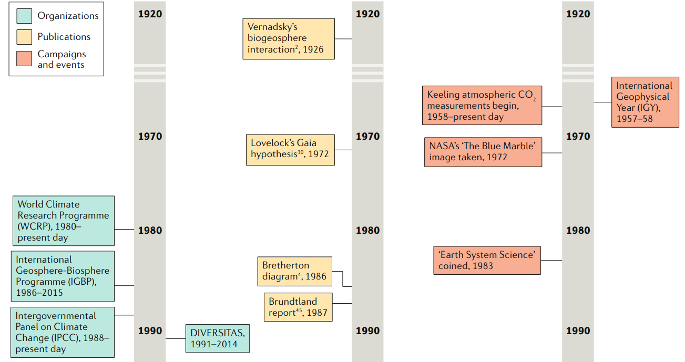

## 1.1.Orígens de les ciències de la biosfera

### Perspectives ecològiques
* Humboldt associa el descens del nivell del llac Valencia (Veneçuela) a la deforestació local.

::: columns

::: column

:::

::: column
> **“By felling the trees, that cover the tops and the sides of mountains, men in every climate prepare at once two calamities for future generations; the want of fuel, and a scarcity of water.”**
 

> Humboldt (1818–29), *Personal Narrative of Travels to the Equinoctial Regions of the New Continent*.
:::

:::

### La biosfera com a idea

- Vernadksy

### Els inicis: 1920s - 1970s

- Text

{width=70%}

## 1.2. Eines, conceptes i metodologies per les ciències de la biosfera

## 1.3. El Sistema Terra
